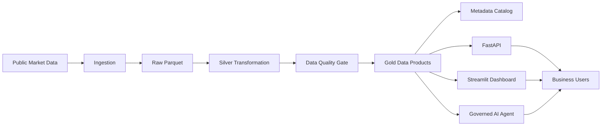

# Mexico Equity Intelligence Platform

> *Transforming market activity into governed, AI-ready data products that power financial intelligence.*

---

## Project Vision

This platform applies Data Engineering, Market Intelligence and Artificial Intelligence to turn public Mexican equity observations into trusted information assets.

Those assets are governed, reusable and designed for delivery through APIs, dashboards, reports and controlled AI services.

The result is a practical foundation for financial intelligence and data monetization, built as a reproducible local MVP.

---


```text
Public Market Data -> Raw -> Silver -> Quality -> Gold -> Metadata -> API -> Governed AI Agent
```



## Business Value

This project is not a price prediction exercise. It demonstrates how market data can be packaged as business-ready Market Intelligence products.

The platform is framed from the point of view of a stock exchange or financial data provider: raw market activity and prices are inputs, but the business sells trusted information, governed distribution, analytics, access, and insight services.

The platform helps a market data business, exchange, issuer relations team, or financial intelligence provider:

- Convert raw public market prices into reusable data products.
- Offer performance, volatility, liquidity, trend, and AI-ready insight datasets.
- Expose governed datasets through APIs for downstream customers and applications.
- Give analysts and business users a dashboard for fast market monitoring.
- Use a Governed AI Agent that answers only from controlled Gold datasets, reducing hallucination risk.
- Create a foundation for premium subscriptions, executive reports, alerts, and sector intelligence products.

Main message:

```text
Transforming public market data into AI-ready data products for Market Intelligence and data monetization.
```

## Stock Exchange Business Context

A stock exchange monetizes more than transactions. It can create business value by packaging market activity into products for issuers, brokers, investors, fintechs, data vendors, research teams, and internal commercial teams.

This MVP shows how that information business can work:

- **Issuers** can understand how their stock compares with sector behavior, liquidity, and market attention.
- **Brokers and analysts** can consume ranked performance, risk, liquidity, and trend signals.
- **Fintechs and data vendors** can integrate curated market intelligence through APIs.
- **Internal exchange teams** can use dashboards and reports to support issuer relations, market development, and premium data services.
- **Executives** can receive explainable summaries instead of raw price tables.

## Monetization Strategy

The Gold layer is designed as the commercial product layer. Each dataset answers a business question that can become a paid feature:

- **API subscriptions:** endpoints for performance, volatility, liquidity, trends, and insights.
- **Premium dashboard:** analyst-facing market intelligence views for monitoring issuers and sectors.
- **Market alerts:** unusual volume, elevated volatility, underperformance, or sustained growth signals.
- **Executive reports:** recurring summaries generated from governed Gold datasets.
- **AI assistant:** a controlled question-answering interface over trusted market intelligence products.

The commercial idea is simple: the value is not the raw price history; the value is the governed layer that turns data into decisions, APIs, alerts, and explainable AI responses.

## Prerequisites

- [Git](https://git-scm.com/downloads/) to clone the repository
- [Docker Desktop](https://www.docker.com/products/docker-desktop/) with Docker Compose
- Internet access for Yahoo Finance downloads
- Available local ports: `8000` for the API and `8501` for the dashboard

No local Python installation, cloud account, API token, paid BMV service, or BMV credentials are required.

## Quick Start

Clone the repository and enter the project folder:

```bash
git clone https://github.com/Yhodiux/mexico-equity-intelligence-platform.git
cd mexico-equity-intelligence-platform
```

Run the full local pipeline:

```bash
docker compose run --rm pipeline
```

Run tests:

```bash
docker compose run --rm tests
```

Start the API and dashboard together:

```bash
docker compose up
```

Open both local services:

```text
http://localhost:8501
http://localhost:8000/docs
```

## OpenAI API Key Setup

The project runs without an OpenAI API key. In that mode, the deterministic agent works normally and `/ask-llm` returns governed Gold evidence with a controlled configuration message.

To enable real model-backed answers in the LLM-governed assistant, create a local `.env` file from the example file:

```bash
cp .env.example .env
```

On Windows PowerShell:

```powershell
Copy-Item .env.example .env
```

Then edit `.env` and set:

```text
OPENAI_API_KEY=your_openai_api_key_here
OPENAI_MODEL=gpt-4.1-mini
ENABLE_LLM_AGENT=true
```

Create the API key from the OpenAI platform dashboard and make sure billing/credits are enabled before testing model-backed responses. OpenAI API usage can generate costs. Do not commit `.env` or any real API key to the repository.

## Quick Product Tour

Use the final release candidate:

```bash
git checkout v1.0-rc3
```

Then explore the platform in this order:

1. Run `docker compose run --rm pipeline` to build Raw, Silver, Gold, quality, and metadata outputs.
2. Run `docker compose run --rm tests` to validate the pipeline, API, and governed AI behavior.
3. Start both runtime services with `docker compose up`.
4. Open the dashboard at `http://localhost:8501` and the API docs at `http://localhost:8000/docs`.
5. Call `GET /questions` to inspect the deterministic governed question set.
6. Call `POST /ask` with `Which issuers had the best 30-day performance?`.
7. Call `POST /ask-llm` with `Explain WALMEX.MX in executive terms.`.
8. Validate guardrails with `Who won the World Cup?` and `Should I buy WALMEX.MX today?`.

The expected result is a complete local market intelligence product: governed datasets, API distribution, dashboard consumption, deterministic question answering, LLM-governed narrative answers, and explicit refusal of unsupported questions.

## Executive Presentation

The executive presentation summarizes the business value of the platform, focusing on data products, responsible AI, consumption channels, and monetization opportunities.

It is intended for business leaders, data leaders, technology stakeholders, and market intelligence teams.

- **Interactive version:** [Gamma Presentation](https://gamma.app/docs/Mexico-Equity-Intelligence-Platform-m5u7z5qavr927mz)
- **PDF version:** [Mexico Equity Intelligence Platform Presentation](docs/presentation/mexico-equity-intelligence-platform.pdf)

## Documentation

- [Executive Summary](docs/executive_summary.md)
- [Business Pitch](docs/business_pitch.md)
- [Monetization Strategy](docs/monetization_strategy.md)
- [Data Products Catalog](docs/data_products_catalog.md)
- [Future AWS Architecture](docs/future_aws_architecture.md)
- [Demo Guide](docs/demo_guide.md)
- [Reviewer Guide](docs/reviewer_guide.md)
- [Release Notes v1.0-rc3](docs/release_notes_v1_0_rc3.md)
- [Project Status - 2026-06-20](docs/project_status_2026_06_20.md)
- [Data Flow Architecture](docs/architecture/data_flow.md) including transformation highlights
- [Cloud Roadmap](docs/architecture/cloud_roadmap.md)
- [Data Contracts](docs/architecture/data_contracts.md)
- [Operational Readiness](docs/architecture/operational_readiness.md)
- [Data Products](docs/architecture/data_products.md)
- [Business KPIs and OKRs](docs/business_kpis_okrs.md)

## Platform Components

| Capability | Where to Review |
| --- | --- |
| Reproducible pipeline | `docker-compose.yml`, `src/ingestion/`, `src/transformation/`, `src/gold/` |
| Data quality gates | `src/quality/validate_data_quality.py`, `data/metadata/data_quality_report.json` |
| Governed data products | `data/gold/`, `docs/architecture/data_products.md` |
| Metadata catalog | `src/metadata/build_metadata.py`, `data/metadata/datasets_metadata.json` |
| API distribution | `src/api/main.py`, `http://localhost:8000/docs` |
| Dashboard consumption | `src/dashboard/app.py`, `docs/screenshots/` |
| Governed AI guardrails | `src/ai_agent/market_agent.py`, `tests/test_market_agent.py` |
| Operational thinking | `docs/architecture/operational_readiness.md` |
| Cloud evolution | `docs/future_aws_architecture.md`, `docs/architecture/cloud_roadmap.md` |
| Business monetization | `docs/reviewer_guide.md`, `docs/business_pitch.md`, `docs/monetization_strategy.md`, `docs/data_products_catalog.md` |
| KPIs and OKRs | `docs/business_kpis_okrs.md` |

## Data Engineering Perspective

This repository is structured so reviewers can inspect the engineering decisions directly:

- **Reproducible execution:** Docker Compose runs the pipeline, API, dashboard, and tests without local Python setup.
- **Layered data architecture:** Raw, Silver, Gold, Metadata, and Quality stages are separated by responsibility.
- **Quality as a gate:** validation runs before Gold product publication and writes an auditable report.
- **Data products:** Gold datasets are shaped around business questions, not generic tables.
- **Consumption interfaces:** the same governed datasets feed API endpoints, dashboard views, the deterministic Governed AI Agent, and the optional LLM-governed assistant.
- **Governance and operations:** data contracts, operational readiness, KPIs/OKRs, and cloud migration are documented.
- **Production evolution:** Airflow/MWAA, dbt, cloud storage, API management, usage metering, larger-scale RAG over documents, anomaly detection, personalization, and forecasting models are roadmap options, not current dependencies.

## Future Roadmap

The project is positioned as a Market Intelligence and data monetization platform. Predictive models are intentionally outside the MVP and appear only as future product extensions after the governed data foundation is established.

| Phase | Scope | Positioning |
| --- | --- | --- |
| Phase 1: Current MVP | Raw/Silver/Gold architecture, quality gates, metadata, APIs, dashboard, deterministic agent, LLM-governed assistant | Market Intelligence data product platform |
| Phase 2: RAG enrichment | Add licensed documents, issuer reports, metadata search, and LLM retrieval over governed content | Richer natural-language intelligence |
| Phase 3: Forecasting models | Add Prophet, ARIMA, or LSTM experiments over governed historical datasets | Future advanced analytics capability, not current product behavior |
| Phase 4: Anomaly detection | Detect unusual volume, volatility, liquidity, or data-quality events with statistical and ML methods | Monitoring and alerting intelligence |
| Phase 5: Personalized recommendations | Tailor dashboards, alerts, and content by customer role, entitlement, or workflow | Product personalization, not investment advice |

## Enterprise Production Evolution

The current MVP demonstrates the governed data product foundation. A future AWS production deployment could add enterprise-grade capabilities without changing the platform's batch-oriented design:

- Native AWS observability through CloudWatch Logs, Metrics, Dashboards, and Alarms.
- Operational notifications through Amazon SNS for pipeline failures, data quality issues, stale datasets, and service incidents.
- Secure access through IAM least-privilege roles, OAuth2/OIDC and SSO integration, role-based access control, and customer entitlements by data product.
- Incremental and partitioned batch ingestion for efficient growth in data volume.
- Governed semantic retrieval over approved documents and metadata as an extension of the RAG architecture.

Implementation options and operational considerations are detailed in the [Cloud Roadmap](docs/architecture/cloud_roadmap.md), [Operational Readiness](docs/architecture/operational_readiness.md), and [Future AWS Architecture](docs/future_aws_architecture.md).

## Future AI Enhancements

The following initiatives represent potential future extensions of the platform. They are not implemented in the current MVP and would remain grounded in governed data products, deterministic controls, and human oversight.

### AI-assisted Data Quality Explanations

Future versions could complement deterministic data quality validations with AI-generated explanations that contextualize anomalies and suggest possible follow-up actions for platform operators, data governance teams, and data consumers. AI would support interpretation and triage; established validation rules would remain the authoritative quality controls.

### Executive Daily Market Brief Generation

Governed Gold products could support AI-generated daily executive briefs summarizing observed performance, volatility, liquidity, and market trends. These briefs could evolve into premium information services and Research-as-a-Service offerings while remaining evidence-based and outside the scope of investment advice.

### AI-assisted Metadata Enrichment

Data products could be enriched with AI-assisted business descriptions, recommended use cases, and functional documentation to improve information discovery and consumption. Proposed metadata would remain subject to governance review and approval before publication.

## Demo Preview

### Dashboard Overview


### Dashboard Analytics


### Deterministic Governed AI Agent


### LLM-Governed Market Assistant


### API Market Question


### API Guardrails


## Run pipeline

This pipeline downloads daily historical prices from Yahoo Finance, writes raw Parquet files under `data/raw/`, builds the standardized Silver dataset under `data/silver/`, writes a data quality report under `data/metadata/`, and generates Gold data products under `data/gold/`.

```bash
docker compose run --rm pipeline
```

The pipeline uses the ticker universe defined in `config/tickers.json`.

## Gold datasets

The Gold layer currently generates:

- `gold_performance.parquet`
- `gold_volatility.parquet`
- `gold_liquidity.parquet`
- `gold_market_trends.parquet`
- `gold_ai_insights.parquet`

## Run API

After running the pipeline, start both runtime services:

```bash
docker compose up
```

Available endpoints:

- `GET /health`
- `GET /datasets`
- `GET /performance`
- `GET /volatility`
- `GET /liquidity`
- `GET /market-trends`
- `GET /ai-insights`
- `GET /questions`
- `POST /ask`
- `POST /ask-llm`

## Run Dashboard

After running the pipeline, start both runtime services:

```bash
docker compose up
```

Open:

```text
http://localhost:8501
http://localhost:8000/docs
```

## Ask the Governed AI Agent

The platform exposes two governed AI modes:

- `/ask` is deterministic and answers supported business questions with fully auditable logic.
- `/ask-llm` is an optional LLM-governed assistant that builds structured context from Gold datasets and uses the model only to write a natural-language answer.

Both modes reject out-of-domain questions, forecasts, price targets, and buy/sell recommendations instead of inventing unsupported answers.

```bash
curl -X POST http://localhost:8000/ask \
  -H "Content-Type: application/json" \
  -d "{\"question\":\"Which issuers had the best 30-day performance?\"}"
```

Use `GET /questions` to list the current governed question set.

Example LLM-governed request:

```bash
curl -X POST http://localhost:8000/ask-llm \
  -H "Content-Type: application/json" \
  -d "{\"question\":\"Explain WALMEX.MX in executive terms.\"}"
```

See [OpenAI API Key Setup](#openai-api-key-setup) to enable real model-backed answers. If `OPENAI_API_KEY` is not configured, `/ask-llm` still returns the Gold evidence packet and a controlled configuration message.

Supported questions include:

- Which issuers had the best 30-day performance?
- Which issuers show sustained growth with controlled volatility?
- Which sectors show higher volatility?
- Which companies show unusual volume behavior?
- What are the most relevant market insights?
- Which issuers had the weakest 30-day performance?
- Which issuers have the highest liquidity?
- Which issuers have high risk levels?
- Which sectors had the strongest 30-day performance?
- Show me the latest market snapshot.
- Summarize WALMEX.MX.
- Compare WALMEX.MX and CEMEXCPO.MX.

## Run Tests

Run the automated test suite with Docker:

```bash
docker compose run --rm tests
```

## Troubleshooting

If ports are already in use, stop the existing local services or change the published ports in `docker-compose.yml`. The default ports are `8000` for FastAPI and `8501` for Streamlit.

If `/ask-llm` returns a configuration message, confirm that `.env` exists, `OPENAI_API_KEY` is set, and the OpenAI account has active billing or credits.

If OpenAI returns quota, billing, or rate-limit errors, the deterministic agent and dashboard still work. The LLM-governed endpoint will return controlled provider error information instead of inventing an answer.

If the pipeline is re-run during local testing, Parquet and metadata files under `data/` may change because fresh Yahoo Finance data was downloaded. To discard local regenerated data after review:

```bash
git restore data
```

To stop local services:

```bash
docker compose down
```

## License

Copyright (c) 2026 Yhodiux. All rights reserved.

This is a proprietary market intelligence platform prototype. Reuse, redistribution, commercial use, or incorporation into third-party products requires prior written permission.
