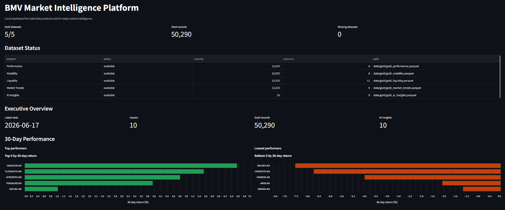
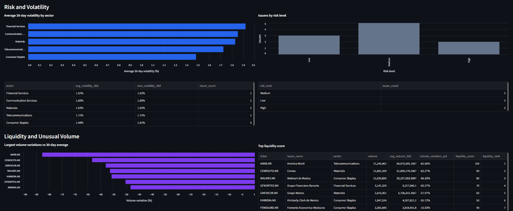
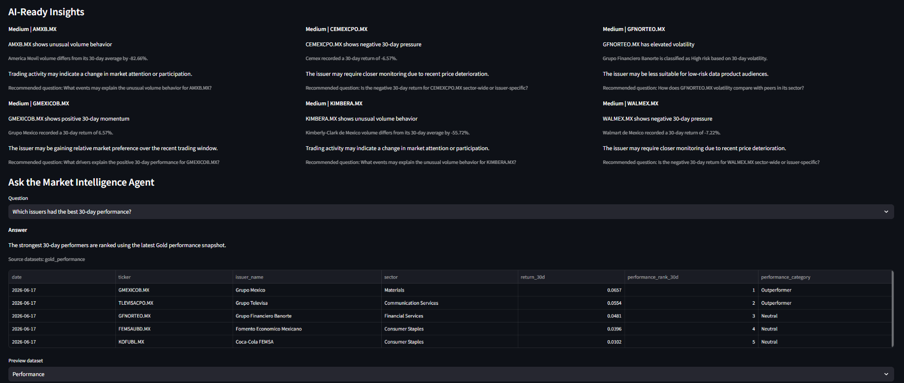
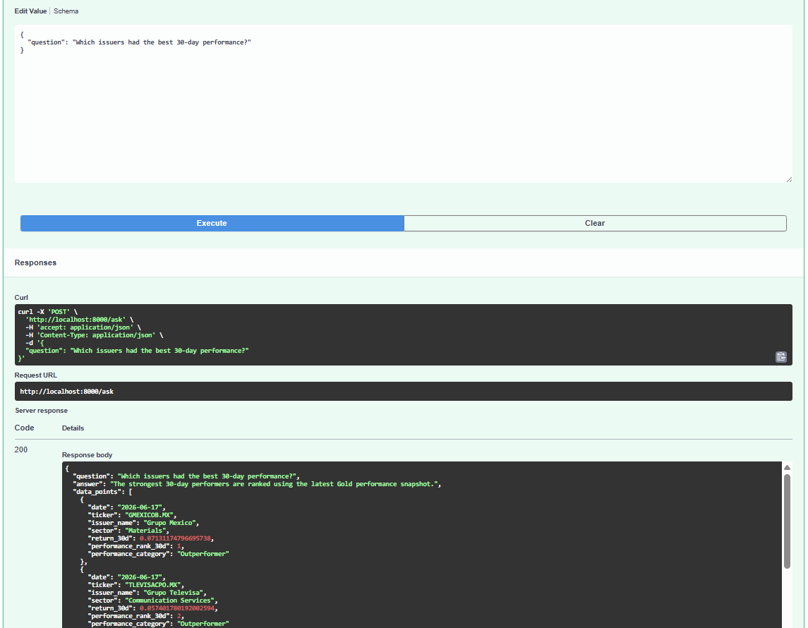
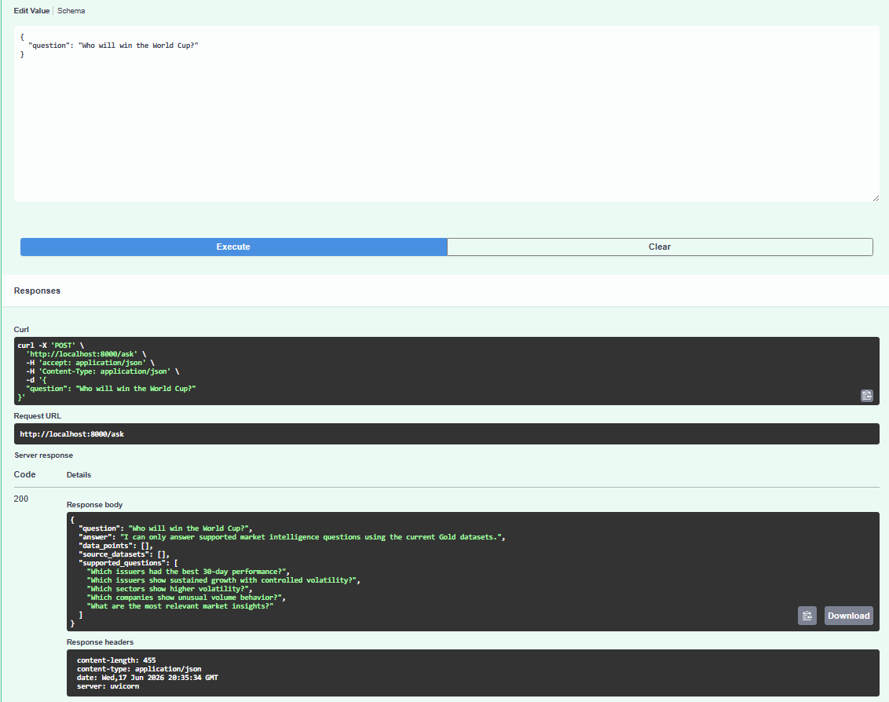

# BMV Market Intelligence Platform

Local data engineering MVP for Mexican market intelligence data products.

The platform transforms public Mexican market data into governed, reusable, AI-ready data products:

```text
Public Market Data -> Raw -> Silver -> Quality -> Gold -> Metadata -> API -> AI Agent
```

## Business Value

This project is not only a price-data pipeline. It demonstrates how market data can be packaged as a business-ready intelligence product.

The platform helps a market data business, exchange, issuer relations team, or financial intelligence provider:

- Convert raw public market prices into reusable data products.
- Offer performance, volatility, liquidity, trend, and AI-ready insight datasets.
- Expose governed datasets through APIs for downstream customers and applications.
- Give analysts and business users a dashboard for fast market monitoring.
- Use an AI Agent that answers only from controlled Gold datasets, reducing hallucination risk.
- Create a foundation for premium subscriptions, executive reports, alerts, and sector intelligence products.

## Monetization Strategy

The Gold layer is designed as the commercial product layer. Each dataset answers a business question that can become a paid feature:

- **API subscriptions:** endpoints for performance, volatility, liquidity, trends, and insights.
- **Premium dashboard:** analyst-facing market intelligence views for monitoring issuers and sectors.
- **Market alerts:** unusual volume, elevated volatility, underperformance, or sustained growth signals.
- **Executive reports:** recurring summaries generated from governed Gold datasets.
- **AI assistant:** a controlled question-answering interface over trusted market intelligence products.

The commercial idea is simple: the value is not the raw price history; the value is the governed layer that turns data into decisions, APIs, alerts, and explainable AI responses.

## Prerequisites

- [Git](https://git-scm.com/downloads/) to clone the repository
- [Docker Desktop](https://www.docker.com/products/docker-desktop/) with Docker Compose
- Internet access for Yahoo Finance downloads
- Available local ports: `8000` for the API and `8501` for the dashboard

No local Python installation, cloud account, API token, paid BMV service, or BMV credentials are required.

## Quick Start

Clone the repository and enter the project folder:

```bash
git clone https://github.com/Yhodiux/bmv-market-intelligence-platform.git
cd bmv-market-intelligence-platform
```

Run the full local pipeline:

```bash
docker compose run --rm pipeline
```

Run tests:

```bash
docker compose run --rm tests
```

Start the dashboard:

```bash
docker compose up dashboard
```

Open:

```text
http://localhost:8501
```

Start the API:

```bash
docker compose up api
```

Open:

```text
http://localhost:8000/docs
```

## Architecture

- [Business Pitch](docs/business_pitch.md)
- [Executive Summary](docs/executive_summary.md)
- [Data Flow Architecture](docs/architecture/data_flow.md) including transformation highlights
- [Cloud Roadmap](docs/architecture/cloud_roadmap.md)
- [Data Products](docs/architecture/data_products.md)
- [Demo Guide](docs/demo_guide.md)

## Demo Preview

### Dashboard Overview



### Dashboard Analytics



### AI Agent



### API Market Question



### API Guardrails



## Run pipeline

This pipeline downloads daily historical prices from Yahoo Finance, writes raw Parquet files under `data/raw/`, builds the standardized Silver dataset under `data/silver/`, writes a data quality report under `data/metadata/`, and generates Gold data products under `data/gold/`.

```bash
docker compose run --rm pipeline
```

The pipeline uses the ticker universe defined in `config/tickers.json`.

## Gold datasets

The Gold layer currently generates:

- `gold_performance.parquet`
- `gold_volatility.parquet`
- `gold_liquidity.parquet`
- `gold_market_trends.parquet`
- `gold_ai_insights.parquet`

## Run API

After running the pipeline, start the local API:

```bash
docker compose up api
```

Available endpoints:

- `GET /health`
- `GET /datasets`
- `GET /performance`
- `GET /volatility`
- `GET /liquidity`
- `GET /market-trends`
- `GET /ai-insights`
- `POST /ask`

## Run Dashboard

After running the pipeline, start the local Streamlit dashboard:

```bash
docker compose up dashboard
```

Open:

```text
http://localhost:8501
```

## Ask the Agent

The `/ask` endpoint answers supported market intelligence questions using the Gold datasets.

```bash
curl -X POST http://localhost:8000/ask \
  -H "Content-Type: application/json" \
  -d "{\"question\":\"Which issuers had the best 30-day performance?\"}"
```

Supported questions include:

- Which issuers had the best 30-day performance?
- Which issuers show sustained growth with controlled volatility?
- Which sectors show higher volatility?
- Which companies show unusual volume behavior?
- What are the most relevant market insights?

## Run Tests

Run the automated test suite with Docker:

```bash
docker compose run --rm tests
```
