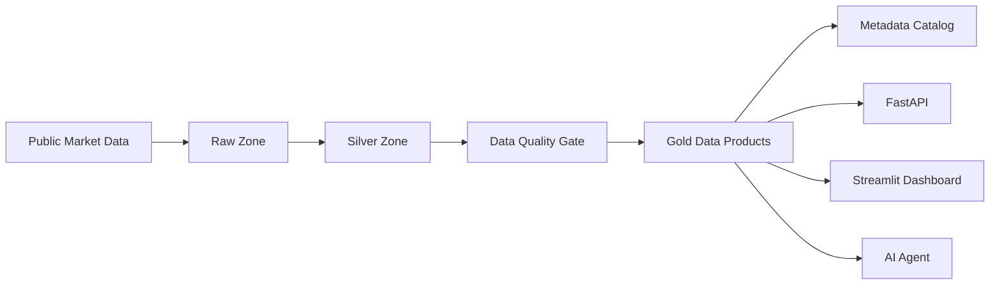

# Data Flow Architecture

## Purpose

The BMV Market Intelligence Platform is a local, Docker-based MVP that transforms public Mexican market data into governed data products and AI-ready answers.

The platform demonstrates the full chain:

```text
Public Market Data -> Raw -> Silver -> Quality -> Gold -> Metadata -> API -> AI Agent
```



## Scope

This MVP does not use BMV Web Services because those services require commercial access, credentials, controlled connectivity, and authorization processes that would make the assessment harder to reproduce.

Yahoo Finance is used through `yfinance` as the technical data source because it provides public historical daily prices without credentials. The business domain remains focused on Mexican market intelligence and BMV-related data products.

## Runtime

The project runs locally through Docker Compose.

```bash
docker compose run --rm pipeline
```

The pipeline executes:

1. `src/ingestion/ingest_yfinance.py`
2. `src/transformation/build_silver.py`
3. `src/quality/validate_data_quality.py`
4. `src/gold/build_gold.py`
5. `src/metadata/build_metadata.py`

The API runs separately:

```bash
docker compose up api
```

## Layers

### Source

The ticker universe is configured in `config/tickers.json`.

The current universe includes representative Mexican issuers such as America Movil, Walmart de Mexico, Grupo Financiero Banorte, Grupo Mexico, Cemex, Grupo Bimbo, FEMSA, Coca-Cola FEMSA, Grupo Televisa, and Kimberly-Clark de Mexico.

The configured extraction window is five years of daily historical data.

### Raw

The Raw layer preserves the market price structure returned by the source.

Output:

```text
data/raw/market_prices_raw.parquet
data/raw/{ticker}.parquet
```

Main fields:

```text
date
ticker
open
high
low
close
adj_close
volume
```

### Silver

The Silver layer standardizes names, enforces types, enriches prices with issuer metadata, and adds derived fields.

Output:

```text
data/silver/market_prices_silver.parquet
```

Derived fields include:

```text
daily_return
intraday_volatility
price_range
volume_category
trend_flag
issuer_name
sector
ingestion_timestamp
```

Transformation highlights:

- Converts source-specific column names into business-readable fields such as `open_price`, `close_price`, and `adjusted_close`.
- Enforces date, ticker, price, and volume typing before downstream product generation.
- Sorts data by issuer and date to support time-series calculations.
- Calculates daily return, intraday volatility, and price range as reusable market signals.
- Classifies daily issuer movement as `Bullish`, `Bearish`, or `Neutral`.
- Categorizes volume by issuer into `Low`, `Medium`, and `High` activity bands.
- Enriches every market record with issuer name and sector metadata.
- Fails the pipeline if configured issuer metadata is missing.

This layer turns raw market observations into clean, enriched analytical records that can safely feed quality checks, Gold data products, dashboards, APIs, and AI responses.

### Data Quality

The quality layer validates Raw and Silver outputs before Gold data products are generated.

Output:

```text
data/metadata/data_quality_report.json
```

Implemented checks include:

- Raw and Silver row counts are greater than zero.
- Required Raw and Silver columns are present.
- Silver ticker and date are not null.
- Silver ticker-date records are unique.
- Prices and volume are non-negative.
- High price is greater than or equal to low price.
- Close price is between low and high when values are comparable.

### Gold

The Gold layer converts clean market data into reusable data products.

Output:

```text
data/gold/gold_performance.parquet
data/gold/gold_volatility.parquet
data/gold/gold_liquidity.parquet
data/gold/gold_market_trends.parquet
data/gold/gold_ai_insights.parquet
```

These datasets are designed for API consumption, dashboards, and grounded AI responses.

Gold transformation highlights:

- Computes 7-day, 30-day, and 90-day issuer returns for performance analysis.
- Computes rolling volatility windows to support risk classification.
- Builds daily issuer rankings for performance and liquidity.
- Calculates 30-day average, maximum, and minimum volume windows.
- Detects volume variation against recent issuer activity.
- Compares issuer returns against sector averages.
- Measures market participation within each sector.
- Converts quantitative signals into AI-ready insight titles, summaries, business interpretations, and recommended follow-up questions.

The Gold layer is intentionally shaped around business questions instead of generic tables. This makes the outputs easier to expose as APIs, dashboard sections, alerts, reports, and controlled AI answers.

### Metadata

The metadata layer catalogs every current dataset and describes its business use.

Output:

```text
data/metadata/datasets_metadata.json
```

Each metadata entry includes:

```text
dataset_name
layer
record_count
column_count
columns
created_at
source
business_description
path
```

### API

The FastAPI service exposes the Gold layer and metadata catalog.

Endpoints:

```text
GET /health
GET /datasets
GET /performance
GET /volatility
GET /liquidity
GET /market-trends
GET /ai-insights
POST /ask
```

### AI Agent

The AI Agent is deterministic and grounded in Gold datasets. It does not call an external LLM and does not answer outside its supported market intelligence scope.

Supported question families:

- Best 30-day performance.
- Sustained growth with controlled volatility.
- Sector volatility.
- Unusual volume behavior.
- Relevant market insights.

If the question is outside the supported scope, the agent returns suggested supported questions instead of inventing an answer.

## Quality Gates

The automated test suite validates the key project contracts:

- Gold datasets are generated with expected columns and row counts.
- Metadata describes the current datasets.
- API endpoints return records.
- The AI Agent answers supported questions and rejects unsupported questions.

Run:

```bash
docker compose run --rm tests
```
